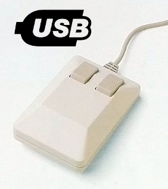
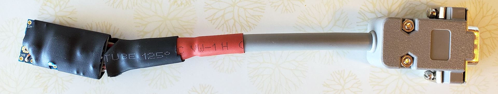

Use your Commodore C1351 mouse with a modern computer.

About
=====

C1351 USB Adapter is an open-source adapter that lets you use a Commodore C1351 mouse with a modern computer. Plug your old mouse into your desktop or laptop computer and use it like any other USB mouse. It shows up as a standard HID mouse, and you can adjust sensitivity in your system preferences.

The firmware makes use of the ATmega's hardware-based input capture counters to ensure extremely accurate readings of the C1351 X and Y positions.

Note that the adapter will not work with a C1350, which uses a different mechanism that works more like a joystick. For C1350, you may want to look at https://github.com/mcgurk/Arduino-USB-HID-RetroJoystickAdapter as a starting point.

Hardware requirements
=====================

Parts
-----

- Adafruit ItsyBitsy 32u4 microcontroller-board_ or equivalent
- female DB9 `connector <https://www.digikey.com/short/n0779crd>`_ and `housing <https://www.digikey.com/short/5nq8nq40>`_
- 9-conductor hookup wire
- 2x 1000 pF ceramic capacitors

.. _microcontroller-board:

Microcontroller board
---------------------

Board must have::

- 5V supply
- 16MHz CPU clock rate
- 2 input capture pins available (ICP1 and ICP3)
- a USB controller chip

Compatible boards::

- `Adafruit ItsyBitsy 32u4 <https://www.adafruit.com/product/3677>`_ (recommended)
- Arduino Leonardo
- Arduino Yun
- Minimus USB
- PJRC Teensy (1.x and 2.x versions)

Other boards with ICP1/ICP3 pins should work, but only Adafruit ItsyBitsy 32u4 has
been tested -- other boards may have slightly different pinouts and may need adjustments (see Circuit section, below).
Note that some boards such as Sparkfun Pro Micro also use ATmega32u4, but don't
expose the ICP3 pin.
Also note that the board must be TTL compatible -- in other words, it must run
off a 5V supply.

Important note: many Arduino-based boards have an LED connected to the ICP3 pin. If this is the case,
you need to **remove the LED** or cut the trace. Otherwise the unit will not work
properly with the C1351.

Circuit
-------

- POT_X and POT_Y inputs(ICP1 and ICP3 pins) should have 1000 pF caps tied to ground. They can be soldered directly to the microcontroller board.
- If dev board has an LED on the ICP3 pin, the LED must be removed
- See include/controller.hpp for pinout of DB9

Building software
=================

`PlatformIO <https://platformio.org/>`_ must be installed::

    pip install platformio

Compile & Upload
----------------

::

    make upload

Compile only
------------

::

    make

Compile debug
-------------

::

    make debug

Generate `compile_commands.json`
--------------------------------

::

    make compiledb

Clean
-----

::

    make clean

References
==========

C1351
-----

- Technical discussion: http://sensi.org/~svo/[m]ouse/
- In-depth technical discussion: http://www.c64os.com/post/1351mousedriver
- C1351 mouse driver for 6502 asm: https://github.com/gnacu/1351mousedriver/blob/master/pollmouse.asm
- C1351 mouse schematics and info: http://monkeyspeak.com/1351/
- C1351 mouse emulator: https://github.com/svofski/mouse1351/blob/master/c1351.c
- MOS5717(chip used in C1351) datasheet: http://www.zimmers.net/anonftp/pub/cbm/documents/chipdata/5717.txt
- C1351 patent: https://patentimages.storage.googleapis.com/df/7b/bd/17f8e7c10822d2/US4886941.pdf
- MOS 6581 SID datasheet: http://archive.6502.org/datasheets/mos_6581_sid.pdf
- SID internals - paddles overview: https://sourceforge.net/p/sidplay-residfp/wiki/SID%20internals%20-%20Paddles%20Overview/
- SID implementation using Arduino: https://github.com/frntc/SIDKick/blob/main/Source/SIDKick/SIDKick.ino
- SID implementation in hardware: https://sourceforge.net/p/sidplay-residfp/wiki/SID%20internals%20-%20Paddles%20Overview/

AVR
---

- http://wp.josh.com/2015/03/05/the-perfect-pulse-some-tricks-for-generating-precise-one-shots-on-avr8/
- ItsyBitsy schematic: https://cdn-learn.adafruit.com/assets/assets/000/049/818/original/development_boards_itsy5v.png
- ATmega32u4 datasheet: https://ww1.microchip.com/downloads/en/DeviceDoc/Atmel-7766-8-bit-AVR-ATmega16U4-32U4_Datasheet.pdf
- AVR IO abstractions: https://mikaelpatel.github.io/Arduino-GPIO/index.html
- AVR IO abstractions: https://github.com/DannyHavenith/avr_utilities
- AVR pin definition template: https://gist.githubusercontent.com/YuuichiAkagawa/2001034/raw/7dd2ab0e78ac572eed5a0e6e818f589877b8524b/AVR%2520pin%2520definition%2520template
- Optimized library for common functions: https://jfpoilpret.github.io/fast-arduino-lib/index.html

LUFA library
------------

- https://fourwalledcubicle.com/LUFA.php

Other C1351->USB adapters
-------------------------

- https://github.com/mcgurk/Arduino-USB-HID-RetroJoystickAdapter
